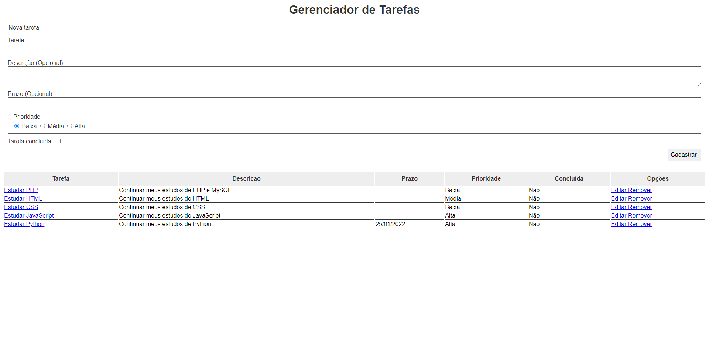
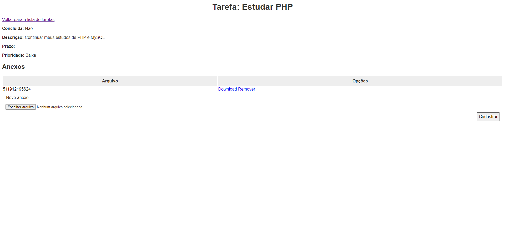
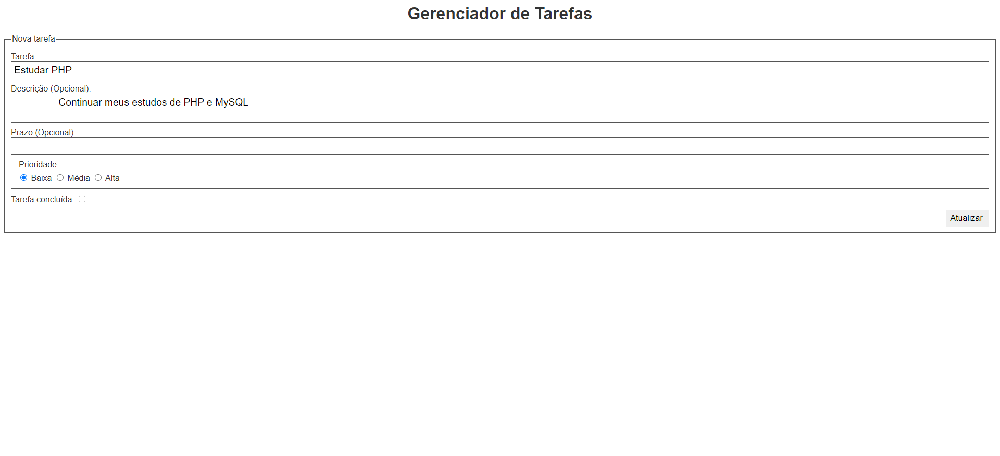

<h1 align="center">
  Desenvolvimento web com PHP e MySQL
</h1>

  <a href="#open_book-sobre">Sobre</a>
  &nbsp;&nbsp;&nbsp;|&nbsp;&nbsp;&nbsp;
  <a href="#hammer-tecnologias">Tecnologias</a>
  &nbsp;&nbsp;&nbsp;|&nbsp;&nbsp;&nbsp;
  <a href="#rocket-resultado">Resultado</a>

## :open_book: Sobre
Este repositório contêm os scripts feitos durante a leitura do livro.

## :hammer: Tecnologias
Este projeto foi feito com as seguintes tecnologias:
- HTML5
- CSS3
- PHP 7
- MySQL

## :rocket: Resultado

  
  
  

 

:computer: Link do livro utilizado : [Casa do Codigo](http://www.casadocodigo.com.br/products/livro-php-mysql)